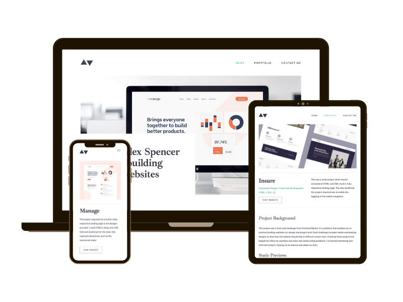

# Minimalist portfolio website

A fully responsive, interactive and accessible minimalist multi-page portfolio.

# Frontend Mentor - Minimalist portfolio website solution

This is a solution to the [Minimalist portfolio website challenge on Frontend Mentor](https://www.frontendmentor.io/challenges/minimalist-portfolio-website-LMy-ZRyiE). Frontend Mentor challenges help you improve your coding skills by building realistic projects.

## Table of contents

- [Overview](#overview)
  - [The challenge](#the-challenge)
  - [Links](#links)
- [My process](#my-process)
  - [Built with](#built-with)
  - [What I learned](#what-i-learned)
  - [Continued development](#continued-development)
- [Author](#author)

## Overview

### The challenge

Users should be able to:

- View the optimal layout for each page depending on their device's screen size
- See hover states for all interactive elements throughout the site
- Click the "About Me" call-to-action on the homepage and have the screen scroll down to the next section
- Receive an error message when the contact form is submitted if:
  - The `Name`, `Email Address` or `Message` fields are empty should show "This field is required"
  - The `Email Address` is not formatted correctly should show "Please use a valid email address"

### Links

- Solution URL: [https://www.frontendmentor.io/solutions/minimalist-portfolio-website-w-vanilla-js-ZeoTRLSMoS](https://www.frontendmentor.io/solutions/minimalist-portfolio-website-w-vanilla-js-ZeoTRLSMoS)
- Live Site URL: [https://sazbot.github.io/portfolio-website/](https://sazbot.github.io/portfolio-website/)

## My process

### Built with

- Semantic HTML5 markup
- CSS utility classes and custom properties
- CSS Flexbox
- CSS Grid
- Mobile-first workflow

### What I learned

- How to use a CSS design system to create utility classes and custom properties
- How to use CSS grid responsively across different device sizes
- How to incorporate accessible rich internet applications (ARIA) to enhance accessibility

### Continued development

- Gain further experience in using CSS grid in responsive design
- Continue to incorporate ARIA roles and attributes with a mind to increasing accessibility

## Author

- Website - [Sarah Fielding Smith](https://www.your-site.com)
- Frontend Mentor - [@sazbot](https://www.frontendmentor.io/profile/sazbot)
- Twitter - [@sazbotty](https://www.twitter.com/sazbotty)
